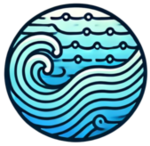

## Ocean Waves

Package Python permettant la génération de surface d'océan utilisant des méthodes state-of-the-art de génération des vagues. 

## Installation
Coming soon

## Features
- Waves spectrum 
    - Pierson Moskowitz
    - JONSWAP
    - ECKV (soon)
- Directional Spreading functions
    - International Towing Tank Conference (ITTC)
    - International Ship and Offshore Structures Congress (ISSC)
    - Stereo Wave Observation Project (SWOP)

## LICENSE
Apache 2.0

## Contributors
@MohamedNennouche